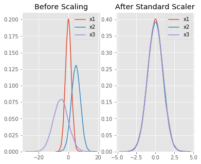
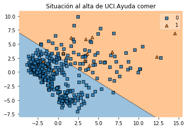
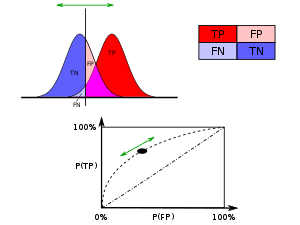
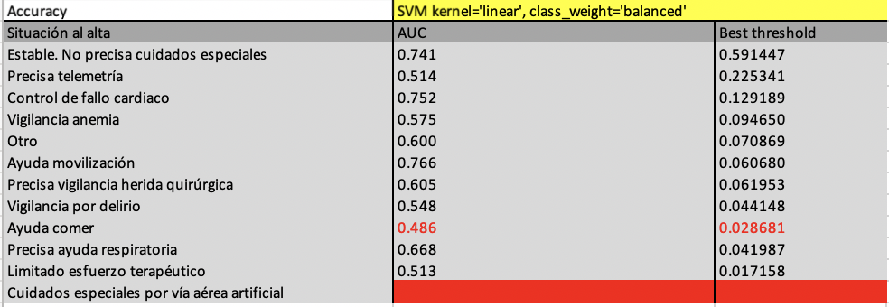
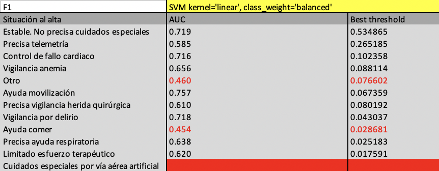
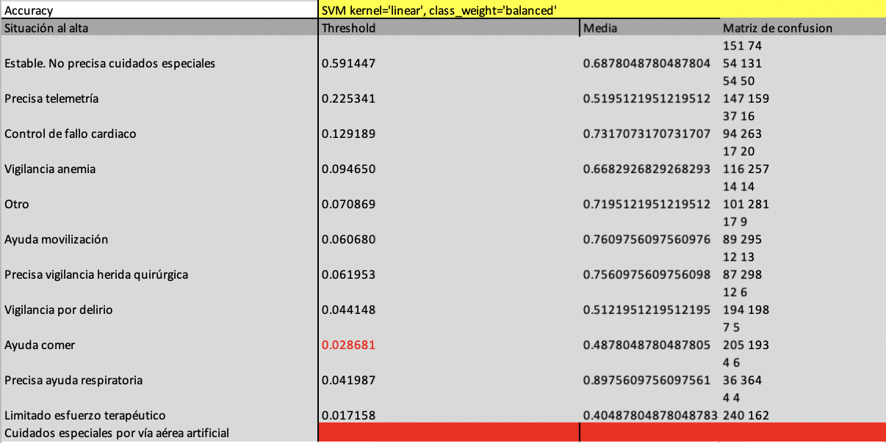
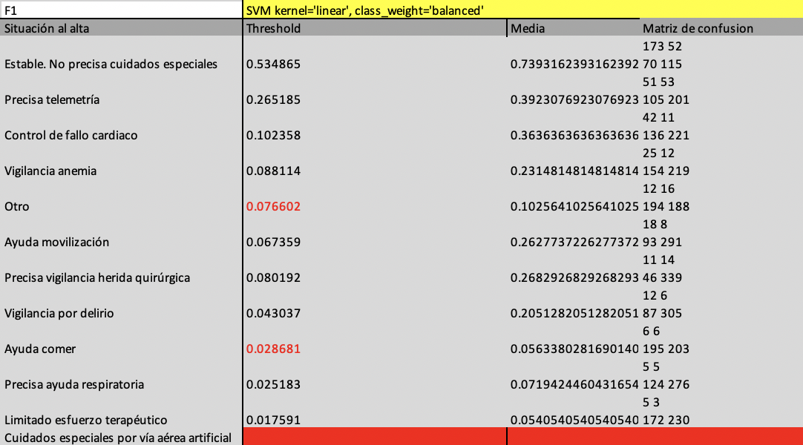
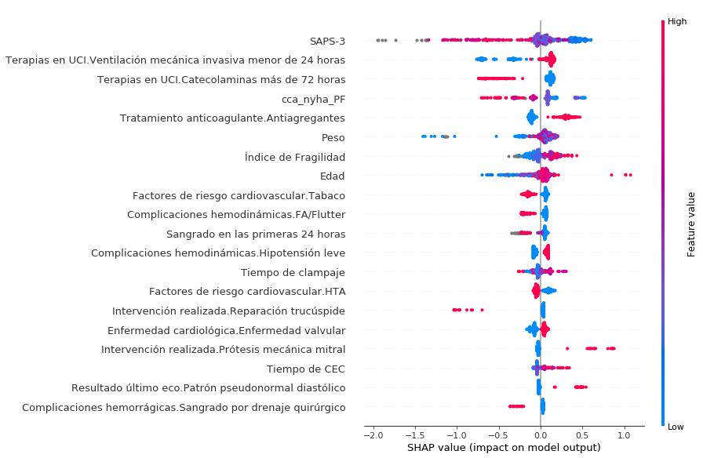
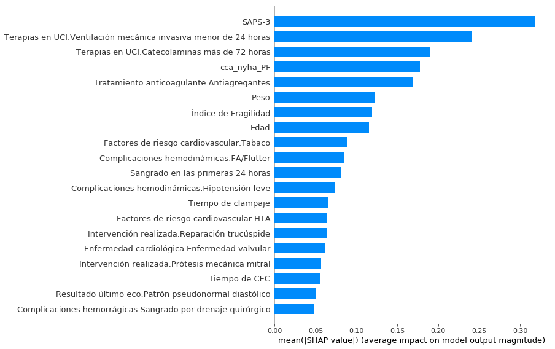

# TFG: Predicción del grado de dependencia de pacientes a la salida de la UCI

## Variables de salida

Situación al alta de UCI.Estable no precisa cuidados especiales:
45.12% - 54.88%

Situación al alta de UCI.Precisa telemetría:
74.63% - 25.37%

Situación al alta de UCI.Control de fallo cardiaco:
87.07% - 12.93%

Situación al alta de UCI.Vigilancia anemia/anticoagulantes:
90.98% - 9.02%

Situación al alta de UCI.Otro:
93.17% - 6.83%

Situación al alta de UCI.Ayuda movilización:
93.66% - 6.34%

Situación al alta de UCI.Precisa vigilancia herida quirúrgica:
93.9% - 6.1%

Situación al alta de UCI.Vigilancia por delirio:
95.61% - 4.39%

Situación al alta de UCI.Ayuda comer:
97.07% - 2.93%

Situación al alta de UCI.Precisa ayuda respiratoria:
97.56% - 2.44%

Situación al alta de UCI.Limitado esfuerzo terapéutico:
98.05% - 1.95%

Situación al alta de UCI.Cuidados especiales por vía aérea artificial:
99.76% - 0.24%

A continuación se muestra la proporción de los datos de salida, tanto de forma relativa como absoluta. Como vemos, todas las clases sufren un desbalanceo, en mayor o en menor medida.

| Situación al alta | False (%) | True (%) | False (abs) | True (abs) |
|-------------------|-----------|----------|-------------|------------|
| Estable no precisa cuidados especiales | 45.12% | 54.88% | 185 | 225 |
| Precisa telemetría | 74.63% | 25.37% | 306 | 104 |
| Control de fallo cardiaco | 87.07% | 12.93% | 357 | 53 |
| Vigilancia anemia/anticoagulantes | 90.98% | 9.02% | 373 | 37 |
| Otro | 93.17% | 6.83% | 382 | 28 |
| Ayuda movilización | 93.66% | 6.34% | 384 | 26 |
| Precisa vigilancia herida quirúrgica | 93.9% | 6.1% | 385 | 25 |
| Vigilancia por delirio | 95.61% | 4.39% | 392 | 18 |
| Ayuda comer | 97.07% | 2.93% | 398 | 12 |
| Precisa ayuda respiratoria | 97.56% | 2.44% | 400 | 10 |
| Limitado esfuerzo terapéutico | 98.05% | 1.95% | 402 | 8 |
| Cuidados especiales por vía aérea artificial | 99.76% | 0.24% | 409 | 1 |

# Tabla de contenidos

1. [Preprocesado](#Preprocesado)
2. [Enfoque](#Enfoque)
    1. [Problema a resolver](#Problema-a-resolver)
    2. [Validación cruzada](#Validación-cruzada)
    3. [Ajuste de hiperparámetros](#Ajuste-de-hiperparámetros)
3. [Algoritmo](#Algoritmo)
    1. [Support Vector Machines](#Support-Vector-Machines)
    2. [Sobreajuste](#Sobreajuste)
4. [Experimentos](#Experimentos)
5. [F1 Score](#F1)
6. [Selección de atributos](#Selección-de-atributos)
7. [Aprendizaje no supervisado](#Aprendizaje-no-supervisado)
8. [Reducción de dimensionalidad](#reducción-de-dimensionalidad)
9. [Análisis ROC](#Análisis-roc)
10. [Multietiqueta](#Multietiqueta)

## Preprocesado

A la hora de alimentar los modelos de aprendizaje automático con datos, estos deben ser inteligibles por el ordenador. Por esta misma razón, muchos de los datos de entrada recibidos por parte del hospital deben ser preprocesados de cierta forma. Dichos procesos se denominan *feature engineering*.

Habitualmente, se pueden clasificar los datos en *categóricos* y *numéricos*.
- Los datos categóricos son aquellos que toman un valor de un número limitado de posibles valores. [1] Estos, a su vez, pueden seguir un orden (ordinal) o no (nominal).  
Una variable categórica y ordinal podría ser la calificación asociada a las notas de un alumno. En el caso de la Universidad de Oviedo, estas calificaciones pueden ser *Suspenso*, *Aprobado*, *Notable*, *Sobresaliente* y *Matrícula de honor*, donde claramente existe un orden entre ellas, siendo *Suspenso* la peor y *Matrícula de honor* la mejor.  Por lo tanto, la forma correcta de procesar estos datos sería asignar un número a cada variable, respetando el orden entre ellas:
    - Suspenso: 0
    - Aprobado: 1
    - Notable: 2
    - Sobresaliente: 3
    - Matrícula de honor: 4
    
    Un claro ejemplo del caso contrario que, además, aparece en los datos proporcionados, es la variable *Sexo*. Dicha variable puede tomar dos valores: *Hombre* o *Mujer*. Sin embargo, en este caso no estamos ante una variable que tome un orden.  
    Si procesamos estos datos de forma que *Hombre* tome valor 0 y *Mujer*, valor 1, ciertos algoritmos podrían suponer que existe un orden entre los géneros. La forma correcta de procesarlos en este caso sería *binarizar* esta variable en dos nuevas:
    - Sexo. Hombre
    - Sexo. Mujer
    
    Que en este caso tomarán valor 0 o 1 según el ejemplo correspondiente. En otro tipo de variables, podría haber más de una que tome valor 1.

- Los datos numéricos son aquellos que toman valores continuos, como podría ser la altura o el peso de una persona.

A continuación se describe una lista de variables junto con el tipo de preprocesado realizado:

- cca_fevi_PF_varab_pre-ingr: variable categórica y ordinal que puede tomar los siguientes valores
    1. No cuantificada: 0
    2. Normal: 1
    3. Disfunción leve (>40): 2
    4. Disfunción moderada (30-40): 3
    5. Disfunción grave (<30): 4
- Cifra de plaquetas más baja: la cifra de plaquetas podría ser una variable numérica pero, a la hora de recoger los datos, se clasifican en categorías ordinales, que son las siguientes
    1. 20.000-49.999: 0
    2. 50.000-99.999: 1
    3. 100.000-149.999: 2
    4. &gt;150.000: 3
- Talla: variable numérica que indica la altura (en centímetros) del paciente
- Peso: variable numérica que indica la masa (en kilogramos) de un paciente
- FECHA NACIMIENTO: variable que indica el día de nacimiento del paciente en formato dd/mm/YY
- Fecha ingreso hospitalario: variable que indica el día en el que el paciente ingresó en la UCI en formato dd/mm/YYYY
- EDAD: variable numérica calculada a partir de las dos anteriores (*FECHA NACIMIENTO* y *Fecha ingreso hospitalario*) que indica la edad del paciente en años.
- Índice de Fragilidad: variable categórica y ordinal que puede tomar los siguientes valores
    1. nan: 0
    2. Muy saludable. Por encima de lo esperado para su edad: 1
    3. Sano: Paciente asintomático, con actividad normal: 2
    4. Controlado: Paciente con sintomatología tratada, con activid: 3
    5. Vulnerable:Independiente, pero con actividad limitada por su: 4
    6. Fragilidad leve: Necesita ayuda para tareas difíciles: 5
    7. Fragilidad moderada: Necesita ayuda dentro y fuera de la cas: 6
    8. Fragilidad grave: Totalmente dependiente para las actividade: 7
    9. Fragilidad muy grave: Totalmente dependiente, no tolera ni l: 8
    10. Enfermedad terminal: Esperanza de vida menor de 6 meses: 9
- Ingreso en: variable categórica que no indica ningún tipo de orden. Puede tomar los siguientes valores
    - Otra: HSA
    - Otra: QUIROFANO
    - Otra: URGENCIAS
    - Otra: h Alvarez Buylla
    - Otra: otro hospital
    - Otra: unidad de ictus
    - Planta
    - Reanimación Quirúrgica
    - UVI Cardiaca
    - UVI Polivalente
    - Unidad Coronaria
- Motivo de ingreso en UCI: variable categórica que no indica ningún orden. Puede tomar los siguientes valores
    - Complicaciones médicas del postoperatorio
    - Enfermedad no cardiológica
    - IAM COMPLICADO
    - Insuficiencia cardiaca
    - PCR reanimada
    - Post-operatorio C.Cardiaca
    - Re-intervención precoz (en el mismo ingreso)
    - Re-intervención tardía (antes de 1 año)
    - TAVI
- núm. concentrados hematies primeras 48 h: variable que, al igual que la cifra de plaquetas, es numérica, pero sus datos se recogen como categóricos de la siguiente forma
    - Menor de 3: 0
    - Mayor o igual a 3: 1
- Otros factores: variable categórica que no indica ningún orden. Además, en este caso, más de una variable podrá ser positiva. Los valores son los siguientes
    - Apertura pleuras
    - Transfusión de 1 a 3 CH intraoperatorios
    - Transfusión de plasma o plaquetas
    - Politrasfusión (más de 3 CH) intraoperatorios
    - Administración de factores de coagulación
- Pico de troponina: variable numérica expresada en categorías ordenadas, que pueden tomar los siguientes valores
    1. Menor de 500: 0
    2. 500-999: 1
    3. 1000-3999: 2
    4. 4000 o más: 3
- Sangrado en las primeras 24 horas: variable numérica expresada en categorías ordenadas, tomando los siguientes valores
    1. Menor de 500 ml: 0
    2. 500-1000 ml: 1
    3. Mayor de 1000 ml: 2
- SAPS-3: variable numérica
- SEXO: variable categórica que no indica orden. Sus valores posibles son
    - Mujer
    - Hombre
- Tiempo de CEC: variable numérica
- Tiempo de clampaje: variable numérica
- Tiempo de isquemia: variable numérica
- Tiempo de parada circulatoria: variable numérica
- Tipo de cirugía: variable categórica que indica un orden según la urgencia de la cirugía
    1. nan: 0
    2. Programada: 1
    3. Emergente (intervención en menos de 48 horas del diagnóstico: 2
    4. Urgente (se interviene durante el ingreso de una descompensa: 3
    
## Enfoque

### Problema a resolver

El problema a resolver se trata de un caso de clasificación mediante aprendizaje supervisado. El conjunto de datos proporcionado por el hospital consiste en un archivo de 410 filas o ejemplos, donde cada una se corresponde con un paciente distinto.  
Tras el procesado realizado previamente, se obtienen 232 columnas o variables, de las cuales 12 serán las variables de salida a predecir. Son las siguientes:
- Situación al alta de UCI.Estable no precisa cuidados especiales
- Situación al alta de UCI.Precisa telemetría
- Situación al alta de UCI.Control de fallo cardiaco
- Situación al alta de UCI.Vigilancia anemia/anticoagulantes
- Situación al alta de UCI.Otro
- Situación al alta de UCI.Ayuda movilización
- Situación al alta de UCI.Precisa vigilancia herida quirúrgica
- Situación al alta de UCI.Vigilancia por delirio
- Situación al alta de UCI.Ayuda comer
- Situación al alta de UCI.Precisa ayuda respiratoria
- Situación al alta de UCI.Limitado esfuerzo terapéutico
- Situación al alta de UCI.Cuidados especiales por vía aérea artificial

Un paciente podrá estar clasificado en más de una etiqueta en el momento de su salida de la UCI, por lo que el problema de clasificación se denomina *multietiqueta*.

Inicialmente, se ha decidido tratar cada etiqueta posible como un problema independiente, es decir, entrenando un modelo distinto para cada salida.

### Validación cruzada

Para estimar un error inicial, se ha empleado la técnica de validación cruzada. Dicha técnica es comúnmente utilizada para validar modelos de aprendizaje automático. Consiste en dividir el conjunto de datos en K particiones o *folds* y realizar K iteraciones, utilizando K-1 *folds* como conjunto de entrenamiento y 1 como conjunto de test.  
Además, es frecuente que dichas particiones sean estratificadas, es decir, que cada una de ellas siga la misma distribución que el conjunto total de datos. Esto es especialmente útil en casos como el presente, en el que los datos no siguen una distribución balanceada. Si, por ejemplo, se dispone de un conjunto de datos de 100 ejemplos, donde 95 etiquetas de salida son 0 y 5 son 1, sería probable encontrarse con una iteración en la que los 5 ejemplos positivos se encontrasen en el conjunto de entrenamiento, no pudiendo realizar las pruebas adecuadamente. También podría darse el caso contrario, donde los 5 casos positivos recayesen en el conjunto de test, de forma que el modelo sería incapaz de predecirlos. En el caso de una validación cruzada estratificada de 5 particiones, cada una de ellas contendría un ejemplo positivo, estando de esta forma siempre presente tanto en el conjunto de entrenamiento como en el de test. 


### Ajuste de hiperparámetros

Por norma general, los algoritmos disponen de ciertos hiperparámetros. [2]  
Una forma de ajustarlos es a base de prueba y error. Para ello, es común utilizar técnicas como *grid search* o *random search*.  
Para el caso de *grid search*, se selecciona una serie de valores para cada uno de los hiperparámetros y se realizan pruebas con todas las combinaciones posibles. Previamente se debe seleccionar una métrica y, tras realizar las pruebas, los mejores hiperparámetros serán los que ofrezcan unos resultados cuya métrica sea la más alta o la más baja, según el caso.  
En el caso de *random search*, se selecciona un abanico de valores para cada uno de los hiperparámetros y, de forma aleatoria, se realizan pruebas con distintas combinaciones un número prefijado de iteraciones.  


Además, es frecuente aplicar dichas técnicas a su vez con otra validación cruzada. De cara a comparar modelos entre sí y, por tanto, a seleccionar los mejores hiperparámetros, una forma adecuada de hacerlo es repitiendo una validación cruzada de 2 particiones 5 veces. [3]  

Aplicando las dos técnicas a la vez, el resultado es una partición inicial del conjunto de datos en 5 *folds*.  
En la primera iteración, se seleccionarán 4 particiones como conjunto de entrenamiento y 1 como conjunto de test. Dichos conjuntos seguirán la misma distribución. A su vez, el conjunto de entrenamiento resultante se dividirá en 2 *folds* aleatorios en 5 ocasiones, por lo que se obtendrán 10 resultados distintos para cada una de las combinaciones de hiperparámetros.  
Se calculará la media de estos vectores de 10 componentes y, tras comparar los resultados, se obtendrá la mejor combinación de hiperparámetros de entre todas las probadas. Por último, se entrenará el conjunto de 4 *folds* inicial con este conjunto de hiperparámetros y se comprobarán los resultados en la partición restante.  
Este proceso se repetirá en 4 ocasiones más.

El resultado final es un vector de 5 componentes. Cada una de ellas indicará el resultado de la métrica escogida para la validación cruzada de 5 particiones. Su media representará los resultados estimados para el modelo.

## Algoritmo

### *Support Vector Machines*

*Support Vector Machines* (SVM) es un conjunto de algoritmos de aprendizaje automático empleados para resolver tanto problemas de clasificación como de regresión, siendo uno de los más conocidos de la familia de algoritmos basados en funciones *kernel*.

Dicho *kernel* es un mecanismo de representación de la información de entrada al algoritmo. Se puede definir como una función k : X × X → R, que asigna a cada par de objetos del espacio de entrada, X , un valor real correspondiente al producto escalar de las imágenes de dichos objetos en un espacio F, que denominaremos espacio de características, es decir:

k(x, y) = hφ(x), φ(y)i,
 
donde φ : X → F.

En este caso, la función kernel utilizada es la siguiente:

kL(x, y) = (x, y) = sum(xi*yi)

Como se ha nombrado previamente, dicho kernel es lineal. En caso de que los datos sigan patrones más complejos (no-lineales), es posible utilizar otras funciones kernel. Las más conocidas y utilizadas son las siguientes:

- Kernel polinómico:

kp(x, y) = ((x, y) + r)^p,

donde *p* representa el grado y *r* el coeficiente

- Kernel gaussiano:

k(x, y) = e^(-(x-y)^2/(2*std))

Una vez definidas las funciones kernel que se encargan de representar los datos de entrada, se debe entender el funcionamiento de las máquinas de vectores soporte. Estas tratan de separar los datos mediante hiperplanos.  
Para simplificar, se considerará un caso de clasificación binaria linealmente separable, donde existen muchos hiperplanos capaces de separar las clases. Sin embargo, muchos de ellos serían muy sensibles frente a ruido y a la hora de generalizar en nuevos ejemplos.  
Por tanto, el hiperplano óptimo será aquel que esté más alejado de los ejemplos de ambas clases, es decir, aquel que maximice el margen entre el hiperplano y los ejemplos.


Sin embargo, los planos no siempre serán linealmente separables, por lo que es necesario introducir variables de holgura que permitan cometer ciertos errores a la hora de realizar la clasificación. Dicha variable indicará en qué medida un ejemplo está bien o mal clasificado. La nueva función a optimizar será:

min. 1/2 * (w,w) + C * sum(holgura)

s.a. yi(hw, xii + b) ≥ 1 − ξi, i = 1, . . . , n,
     ξi ≥ 0, i = 1, . . . , n.

Dicha expresión añade un parámetro C que permitirá regular el grado de sobreajuste permitido. Cuanto menor sea dicho hiperparámetro, más penalización habrá sobre el modelo, evitando posibles casos de *overfitting* o *sobreajuste*.


Con el fin de buscar alternativas que mejoren las métricas, también se ha decidido aplicar *SVM* con un kernel de función de base radial. Esto permite que la función resultante sea no lineal, conllevando en la mayoría de ocasiones modelos más complejos.  
Además, en este caso existe un hiperparámetro más a optimizar, *gamma*.


### Sobreajuste

El *overfitting* o sobreajuste se da cuando un modelo no es capaz de generalizar lo aprendido a la hora de aplicarlo a datos nuevos.  
Si se divide un conjunto de datos en uno de entrenamiento y uno de test y se selecciona una métrica, tras entrenar el modelo mediante la primera partición y calcular la métrica obtenida tanto en el entrenamiento y en el test, el modelo estará sobreajustado si la métrica del conjunto de entrenamiento es superior a la del test.


## Experimentos

Se han realizado los experimentos para todas las variables de salida excepto para *Situación al alta.Cuidados especiales por vía aérea artificial*. Esto es debido a que dicha clase solo contiene un ejemplo positivo, que podría contenerse o en el conjunto de entrenamiento o en el de test. En el primer caso, sería imposible testear los resultados y, en el segundo, el modelo sería incapaz de predecir una clase no observada previamente.

Se ha escogido como técnica de elección de hiperparámetros *grid search*, debido a que el parámetro de penalización *C* habitualmente toma unos valores en un rango conocido. En este caso los valores escogidos han sido:  
(10^-4, 10^-3, 10^-2, 10^-1, 10^0, 10^1)

Como métrica para elegir el mejor valor se ha escogido la exactitud o *accuracy*, que calcula el porcentaje de ejemplos acertados frente al total.  
Por otra parte, también se ha escogido la *accuracy* como métrica para mostrar los resultados de la validación cruzada.

Además, dado que el conjunto de datos del problema sufre un desbalanceo, se ha modificado el código añadiendo un parámetro que tiene en cuenta la presencia de las clases:

```python
class_weight='balanced'
```

Dicho parámetro ajusta los pesos de forma inversamente proporcional a la frecuencia de las clases de los datos de la siguiente manera:

n_samples / (n_classes * np.bincount(y)), es decir, el número de ejemplos dividido entre el número de clases multiplicado por la suma de ejemplos minoritarios

Por otra parte, es común utilizar una *semilla* para inicializar el generador de números pseudoaleatorios, de cara a poder replicar resultados y hacer comparaciones. En este caso, la librería *scikit-learn* ofrece un parámetro que se puede asignar a todas las clases que en algún momento deban inicializar números de forma aleatoria. El código es el siguiente:

```python
random_state=11
```

En modelos lineales, como es el caso de SVM, es preferible estandarizar los datos antes de alimentar al modelo, restando la media de la variable y dividiendo entre la desviación estándar. De esta forma, todas las características tendrán media 0 y desviación estándar de 1. 



Además, se debe establecer una estrategia de imputación de valores nulos, en caso de que estos existan:
- En el caso de las variables categóricas, se han imputado valores según la moda de la característica. 
- En el caso de las variables numéricas, se han imputado valores según la media de la característica.

Todo esto debe hacerse en tiempo de ejecución, es decir, una vez separados el conjunto destinado a entreno y el conjunto destinado a test. De esta forma, la imputación de valores en el conjunto de test se basará en las observaciones obtenidas en el conjunto de entreno.

Por último, se ha decidido entrenar además un *modelo tonto* con el fin de comparar resultados. En este caso, siempre predice la clase mayoritaria, por lo que su exactitud o *accuracy* será igual al porcentaje de ejemplos de la clase mayoritaria presentes en el conjunto de datos.

Los resultados obtenidos han sido los siguientes:


En el caso de uso de un kernel *rbf*, el rango de valores utilizados ha sido el siguiente:  
(10^-4, 10^-3, 10^-2, 10^-1, 10^0, 10^1) para C  
(10^-4, 10^-3, 10^-2, 10^-1) para gamma


Los resultados obtenidos han sido los siguientes:


Para el caso de un kernel polinómico, el rango de valores utilizado ha sido:  
(10^-4, 10^-3, 10^-2, 10^-1, 10^0, 10^1) para C  
(10^-4, 10^-3, 10^-2, 10^-1) para gamma  
(2, 3) para el grado  
(-1) para el coeficiente  

Los resultados obtenidos han sido los siguientes:


## F1 score

En el caso de disponer de conjuntos de datos no balanceados, una *accuracy* o exactitud alta no tiene por qué indicar buenos resultados.  
Por ejemplo, se sabe que solo el 5% de la población tiene cáncer. El resultado de un modelo de aprendizaje automático indica que tiene una *accuracy* de un 94%. Aparentemente puede ser una métrica muy buena pero, si se construye otro modelo cuyo resultado siempre sea que un paciente no tiene cáncer, su *accuracy* sería de un 95%. Por lo tanto, un modelo realmente sencillo con una métrica muy alta no estaría acertando en ningún caso relevante.  
Para estos casos, se emplea la matriz de confusión y métricas como *recall*, *precision* y *F1*.

Una matriz de confusión, en este caso binaria, tiene la siguiente forma:


- True Positives (TP): ejemplos que el modelo predice como positivos y que realmente son positivos
- False Positives (FP): ejemplos que el modelo predice como positivos pero realmente son negativos
- False Negatives (FN): ejemplos que el modelo predice como negativos pero realmente son positivos
- True Negatives (TN): ejemplos que el modelo predice como negativos y que realmente son negativos

En el caso del hipotético caso de cáncer previamente nombrado, los verdaderos negativos serían los casos correctamente predichos pero irrelevantes.  

- *Recall*: se calcula como TP/(TP + FN). Es decir, indica cuántos casos se han acertado de entre todos los que realmente son positivos.
*De todos los pacientes con cáncer, ¿cuántos se han predicho como pacientes con cáncer?*
- *Precision*: se calcula como TP/(TP + FP). Es decir, indica cuántos casos son realmente positivos de entre todos los predichos como positivos.
*De todos los pacientes predichos como enfermos de cáncer, ¿cuántos son realmente enfermos de cáncer?*
- *F1*: se calcula como una media armónica entre *recall* y *precision*:  
    > F1 = 2·recall·precision/(recall+precision)

Todas estas métricas alcanzan su mejor valor en 1 y, su peor, en 0.  
En el caso de que la variable minoritaria fuese la negativa, se deberían cambiar los cálculos para que dicha variable pase a ser la relevante.

## Selección de atributos

Dado que el conjunto de datos tras el preprocesado tiene un total de 220 atributos o características, muchas de ellas pueden ser irrelevantes y *perjudiciales* para el modelo.  
Para seleccionar las más importantes o, las que al menos den lugar a mejores métricas, se ha empleado el algoritmo *Recursive Feature Elimination* (RFE).  
Este algoritmo usa los pesos calculados en los *support vectors* como criterio para ranking. Realiza iteraciones, eliminando en cada una de ellas la variable con menos peso. Al final, el número óptimo de características será aquel que tenga una métrica más alta. Además, es común realizar este procedimiento mediante una validación cruzada, para evitar un sobreajuste y obtener métricas a priori más realistas.  

En este caso, se ha aplicado RFE con una validación cruzada de 5 particiones, entrenando un modelo SVM lineal. Para la elección del parámetro C, se ha aplicado un *grid search* sobre los siguientes valores:  
(10^-4, 10^-3, 10^-2, 10^-1, 10^0, 10^1)

Una vez obtenida el mejor parámetro C y la mejor selección de características, se ha vuelto a entrenar el modelo con una validación cruzada de 5 particiones. Se han realizado pruebas tanto optimizando la *accuracy* como *F1*.

Los resultados para la accuracy son los siguientes:


Para la F1:


Por norma general, las métricas *recall*, *precision* y *F1* se calculan para la variable minoritaria, que suele ser la positiva. Esto es un aspecto a tener en cuenta a la hora de entrenar el modelo para la variable *Estable. No precisa cuidados especiales*, cuya variable mayoritaria, por suerte, es la positiva.  
Por lo tanto, en este caso habría que calcular un *F1* a partir de la clase negativa.

En el caso de la *accuracy*, los resultados mejoran pero ninguna, salvo la variable *Estable. No precisa cuidados especiales*, supera los resultados del *Dummy Classifier* o clasificador tonto, que siempre predice la clase mayoritaria.  
Estas mejoras se aprecian mucho más en el caso de la *F1*, que mejora significativamente en algunos casos, como *Ayuda movilización* o *Precisa ayuda respiratoria*.

Dado que el problema tiene relación con la salud de seres humanos, estas métricas se deben interpretar con mucho cuidado, prestando especial atención a los resultados mostrados en las matrices de confusión.  
En estos casos, los *falsos negativos* son especialmente relevantes. Cada uno de ellos es un paciente que, según el modelo, tiene una probabilidad baja de darse de alta en la UCI con ciertas dependencias cuando, realmente, la situación es la opuesta.  
Sin embargo, un falso positivo es un paciente para el que el modelo predice una dependencia en su salida y, sin embargo, dicho paciente no sufre tal dependencia.

> Más vale prevenir que curar

## Aprendizaje no supervisado

Para el caso de la variable *Situación al alta de UCI.Cuidados especiales por vía aérea artificial*, que solo contiene un ejemplo positivo, se ha intentado aplicar aprendizaje no supervisado mediante detección de *outliers*. Sabiendo que la proporción de datos positivos es de 99.76% frente a solo un 0.24%, se ha aplicado un *isolation forest*.  
La idea de este algoritmo de árboles se basa en que aquellos ejemplos que se consideran anomalías necesitan menos *splits* o divisiones para aislarse, es decir, la ruta final obtenida por el árbol será más corta.  
Para ser capaces de entender de forma visual si el ejemplo se considera un outlier o no, se ha aplicado un algoritmo de reducción de dimensionalidad: Principal Component Analysis (PCA). Dicho algoritmo se basa en obtener nuevas características que son combinaciones lineales de las originales. Si, a partir de las dimensiones originales, se obtienen 2 o 3, será una tarea trivial representar los nuevos datos. Las variables resultantes se denominan latentes y no representan ninguna característica concreta, sino una combinación de las originales.  
El modelo ha sido capaz de clasificar el ejemplo correctamente. Sin embargo, para conseguirlo se ha utilizado como parámetro la proporción de outliers (0.24%).  


## Reducción de dimensionalidad

Con el fin de entender los datos de una forma más *visual*, se ha aplicado un algoritmo de reducción de dimensionalidad: *análisis de componentes principales* (PCA). Este algoritmo representa los datos en un espacio de un número concreto de dimensiones indicado. En este caso, se han escogido dos con el fin de representar los datos.  
Las variables resultantes se denominan latentes, dado que no representan ninguna característica concreta, siendo simplemente una combinación de las originales.

[Notebook](https://github.com/diegoglozano/TFG/blob/master/Notebooks/SVM_linear_notebook.ipynb)

Además, se ha aplicado el algoritmo SVM sobre todos los datos (sin división previa en conjunto de entrenamiento y test), con el fin de apreciar cómo se distribuyen los ejemplos a lo largo de los ejes y cómo los divide el clasificador.

Los resultados son los siguientes, con las variables ordenadas en función de la proporción de positivos a la salida:





Como se puede apreciar en las gráficas, los ejemplos tienden a acumularse cuando las dos variables latentes toman valores bajos y, esto, parece indicar una situación al alta del paciente estable. También existen muchos casos con las mismas características en los que el paciente precisa telemetría, una situación, a priori, menos grave que las siguientes.  
Por otra parte, a medida que se avanza en las situaciones de los pacientes y disminuyen los ejemplos positivos, suele tratarse de dependencias más graves (como por ejemplo *precisa ayuda respiratoria*). Estos ejemplos tienden a situarse en la zona en la que existe menos acumulación de pacientes. En el caso de *Cuidados especiales por vía aérea artificial*, el paciente se encuentra completamente aislado respecto a los demás.  
Por lo tanto, aparentemente se podría establecer un eje diagonal que indicase la gravedad del paciente, siendo esta mayor cuando las variables latentes toman valores más altos, y menor cuando toman valores más bajos. **REGRESIÓN LINEAL**

## Análisis ROC
Otro método para medir el rendimiento de un clasificador es el uso de las curvas ROC (*Receiver Operating Characteristics*). Dichas curvas se construyen enfrentando el *False Positive Rate* frente al *True Positive Rate*. Estas métricas se definen de la siguiente forma:

- *True Positive Rate* o *sensivity* se define como el número de verdaderos positivos entre la suma de verdaderos positivos más los falsos negativos.
> De los que son positivos, ¿cuántos clasifico como positivos?
- *False Positive Rate* se define como 1-*specifity*. *Specifity* se calcula como el número de verdaderos negativos entre la suma de verdaderos negativos más el número de falsos positivos.
> De los que son negativos, ¿cuántos clasifico como positivos?

Si, en lugar de obtener clases, se calculan probabilidades de cada clase para cada ejemplo, se puede establecer un umbral que marca la diferencia entre una clase y otra. Utilizando distintos umbrales y calculando el *TPR* y el *FPR* correspondiente, se puede establecer una curva ROC.  
Una métrica común para observar la calidad de la curva ROC consiste en medir el área bajo su curva (*AUC*). Dicha métrica será óptima si su valor es 1: esto significa que las clases son *PERFECTAMENTE SEPARABLES*. Además, se establece como valor base 0.5, el peor valor posible. En caso de que el área bajo la curva sea menor que 0.5 significará que, simplemente prediciendo lo contrario se mejorarán los resultados. 



Una vez obtenidos estos valores, se puede definir como mejor umbral aquel cuyo TPR sea mayor y FPR menor, es decir, el punto más cercano a la esquina superior izquierda (TPR=1 y FPR=0).

Se han realizado experimentos en una validación cruzada de 5 particiones + Grid Search de 2 particiones repetidos 5 veces, optimizando en un caso la *accuracy* y en el otro la *F1*.

Accuracy  


En este caso, la variable *Ayuda al comer* no supera un área bajo la curva de 0.5, por lo que simplemente prediciendo lo contrario se obtendrían unas métricas mejores.

F1  


Para el caso de *F1*, tampoco se supera en la variable anteriormente nombrada y, además, en la variable *Otro*.

Es común utilizar como umbral 0.5 a la hora de decidir a qué clase pertenece un ejemplo. Como se aprecia en el cuadro, los valores de los umbrales en las clases menos balanceadas son muy bajos, lejanos a dicho valor. Para comprobar si utilizando estos nuevos umbrales se obtienen mejoras significativas, se han repetido los experimentos, de nuevo optimizando en un caso la *accuracy* y en el otro la *F1*.  

Los resultados son los siguientes:

Accuracy  


F1  


## Multietiqueta
Como se dijo previamente, los pacientes pueden encontrarse con varias situaciones de dependencia a la salida. Este tipo de problemas se denominan *multietiqueta*. Una forma de enfocarlos es mediante el uso de *aprendizaje profundo* y redes neuronales.  
Las redes neuronales son un tipo de modelo de aprendizaje automático. Están formadas por distintas unidades o neuronas conectadas entre sí. Cada unidad realiza una operación matemática (W·X+b) y aplica una función de activación (a(W·X+b)). Es común que dicha función de activación sea no-lineal, con el fin de encontrar patrones más complejos en los datos.  
Si, en la capa de salida, existe una neurona por cada salida (en este caso 11), aplicando una función *sigmoide* a cada una obtendremos las salidas individuales, pudiendo activarse varias (o ninguna) a la vez.

**EXPLICAR MÁS**  
**RESULTADOS (TERRIBLES)**


## Árboles de decisión
Otros algoritmos frecuentemente utilizados son los árboles de decisión.

Dado que un solo árbol de decisión tiende al sobreajuste, es común utilizar un ensamblaje de árboles. Cada uno de estos árboles se denomina clasificador o regresor débil (según el caso). Por ejemplo, en caso de clasificación binaria, un clasificador débil es cualquiera capaz de alcanzar más de un 50% de acierto o, dicho de otra forma, capaz de acertar más que el azar. Para que cada uno de los árboles encuentre patrones distintos, estos se alimentan de *subsets* de los datos, es decir, escogen un porcentaje de filas o columnas del conjunto de datos.

Dichos ensamblajes se pueden clasificar en dos categorías:
- Bagging: los árboles son entrenados independientemente y se obtiene una decisión a partir de sus salidas. Por ejemplo, en una regresión, una salida posible sería la media de las salidas de los árboles. En caso de un problema de clasificación, un método para obtener una salida final podría ser la clase predicha por la mayoría de árboles
- Boosting: los árboles son entrenados secuencialmente, por lo que los árboles que se entrenan más tarde tienen información sobre los errores de los primeros

Uno de los algoritmos basado en boosting de árboles más utilizado hoy en día es XGBoost. 

Se han realizado los mismos experimentos explicados previamente (con SVM) con dicho algoritmo.  
A la hora de utilizar *boostings* de árboles de decisión existen muchos hiperparámetros que se pueden optimizar. Los más importantes son:
- Número de árboles
- Profundidad de árbol: el número de niveles o decisiones que el árbol puede tomar
- Ratio de aprendizaje: dado que los árboles entrenan secuencialmente, es más probable que tiendan al sobreajuste, por lo que cada vez que se entrena un árbol nuevo se le da un peso menor
- scale_pos_weight: parámetro para dar más peso a ciertas clases (útil para conjuntos de datos no balanceados)

Para el grid search se han asignado ciertos valores comunes a estos parámetros:

- Profundidad del árbol: [2, 3]
- Ratio de aprendizaje: [0.1, 0.01, 0.001]
- Número de árboles: [200, 300, 400]
- 'scale_pos_weight': [y.value_counts()[1]/y.value_counts()[0], 1]

En este caso, el preprocesado de datos realizado ha sido distinto al programado para SVM. En este caso, las variables categóricas, al no ser soportadas por el framework, se han sustituido por números, teniendo en cuenta el orden que existe entre ellas en caso de que dicho orden exista.  
Por otra parte, el framework es capaz de manejar los valores NaN por sí solo, por lo que no ha sido necesaria una estrategia de imputación de valores.  
Por último, en el caso de algoritmos basados en árboles, tampoco es necesaria la estandarización o escalado de datos, dado que los árboles realizan las divisiones o *splits* a partir del orden de los datos, independientemente de cual sea su valor.

Los resultados son los siguientes:

**TABLA XGBOOST ACC VS F1**

Una de las ventajas que tienen los árboles de decisión es su facilidad para ser explicados. La mayoría de los frameworks implementan métodos para calcular la importancia que tienen las variables en un modelo a la hora de obtener una salida. Dichas importancias son calculadas a partir de las divisiones o *splits* que realizan los árboles para obtener decisiones. 

Sin embargo, por norma general estos métodos no proporcionan información sobre los ejemplos individualizados, sino que obtienen unos resultados a nivel global. En el año 2017 se obtuvo un método para obtener importancias en variables y, de esa forma, poder explicar adecuadamente cómo los modelos se comportan a la hora de predecir unos valores u otros.  
Esto se realiza mediante el cálculo de los valores *SHapley Additive exPlanation* (en adelante *SHAP*).  
En un campo tan relevante como lo puede ser el de la medicina, resulta muy interesante no solo ser capaz de predecir con precisión dolencias o enfermedades o, en este caso, situaciones de dependencia a la hora de dar un alta en la UCI, sino saber cuáles son las características que más influyen en el paciente. Especialmente porque existen ciertas variables sobre las que los médicos pueden actuar, minimizando de esta forma las posibles consecuencias.

Los resultados para cada una de las variables son los siguientes:

### Estable. No precisa cuidados especiales





En la primera figura, cada uno de los puntos representa un paciente y, el color, el valor de la variable según la escala de la derecha. El SHAP value representa el impacto de la variable sobre la salida.  
En este caso, un valor de SAPS-3 bajo tiene más impacto sobre un paciente a la hora de ser estable. Esto tiene sentido dado que SAPS-3 es un modelo que trata de predecir la mortalidad de un paciente a partir de ciertos datos y, cuanto mayor, más probabilidad de mortalidad tiene.

[1]: https://es.wikipedia.org/wiki/Variable_categ%C3%B3rica

[2]: Aquellos que deben ser asignados antes de la ejecución

[3]: http://citeseerx.ist.psu.edu/viewdoc/download?doi=10.1.1.37.3325&rep=rep1&type=pdf